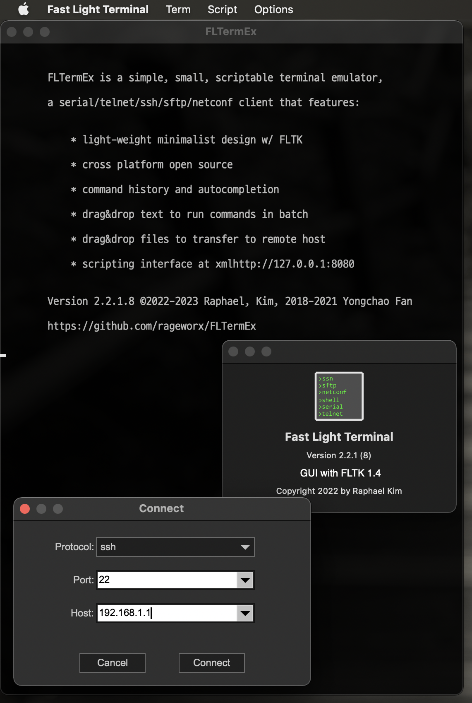

# FLTermEx

This project is implemenation of  [FLTerm](http://yongchaofan.github.io/FLTerm) for better experience with FLTK-1.4.0.x-custom.

*Minimalist terminal emulator, designed by network engineer for network engineers, with unique features for effeciency and effectiveness when managing network devices like routers, switches, transponders and ROADMs through command line interface.*

## Changes from original repository

- Supports better build enviroments
- Fixed more warning of C++ standards.
- Standalone macOS application with install package.

## Project philosophy

FLTerm(Fast Light Terminal, formally "tinyTerm2") is a rewrite of tinyTerm in C++ with FLTK and libssh2+mbedtls, resulting a cross platform terminal emulator, with multi-tab support, and continues to be small, simple and scriptable. win64 executable is 824KB, macOS and linux executables are just above 1MB.

User interface design is minimal, program starts with no tabs, tabs are enabled automatically when second connection is made; scrollbar hidden until user trys to scroll back, only one dialog for makeing connections, 
    
### Minimal requiremented libraries 

- libssh2 
    - 1.9.0 for full support of WinCNG crypto functions
            ./configure --with-crypto=wincng --without-libz
            make install
            
- mbedTLS 
    - crypto library only for WindowsXP, download mbedtls-2.16.1, 
            "make no_test install"          //add WINDOWS_BUILD=1 on windows 
            then build libssh2
            ./configure --with-crypto=mbedtls --without-libz
            make install
            
### source files included:

    ssh2.h and ssh2.cxx implements ssh/netconf and sftp hosts
    host.h and host.cxx implements telnet, serial and shell host
    Fl_Term.h and Fl_Term.cxx implements a vt100 terminal widget using FLTK
    Fl_Browser_Input.h and Fl_Browser_Input.cxx extends Fl_Input with autocompletion
    tiny2.cxx combines Fl_Term, host and ssh2 to create the simple terminal application  

## Building
FLTerm able to compile with 
- MingW-W64 x86 systems with MSYS2.
- macOS with command line development tool, recommend brew with iTerm2
- Linux with gnu tools.

### Makefiles 
- Makefile.mingw 
    are provided for building with MSYS2 + MinGW-W64.
- Makefile.macos  
    building with libssh2 backend on macOS using Xcode command line tools and gmake
